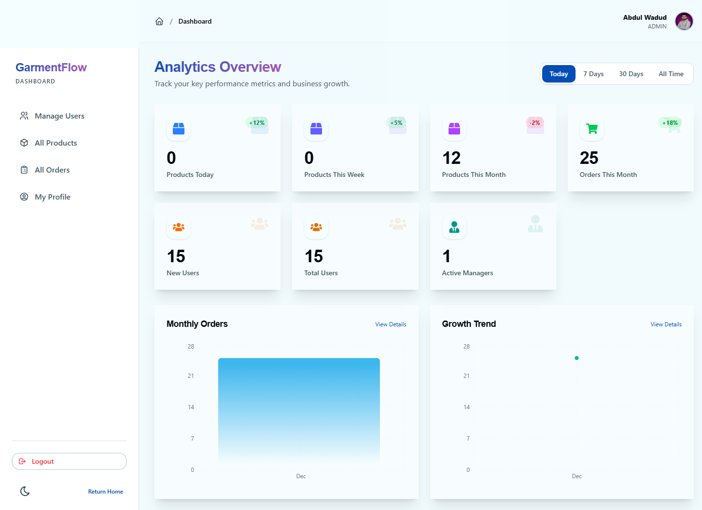

# GarmentFlow API - Server

**GarmentFlow API** is the robust backend powering the GarmentFlow apparel management platform. It allows for secure user management, product inventory control, order processing, and payment handling. Built with Node.js and Express, it features a stateless REST architecture secured by JWT and MongoDB.

| Home Page | Admin Dashboard |
| :---: | :---: |
|  |  |
---

**Live Site:**
[https://garments-flow.vercel.app/](https://garments-flow.vercel.app/)  
**Client Repo:**
[https://github.com/ashikurahman1/garments-flow-c](https://github.com/ashikurahman1/garments-flow-c)  
**Server Repo:**
[https://github.com/ashikurahman1/garments-flow](https://github.com/ashikurahman1/garments-flow)
## Key Features

### Security & Authentication
-   **JWT Authentication**: Stateless session management using securely signed JSON Web Tokens.
-   **Middleware Protection**: Custom `verifyToken` and Role Verification (`verifyAdmin`, `verifyManager`) middleware to secure endpoints.
-   **CORS Configuration**: Secure Cross-Origin Resource Sharing setup for trusted client communication.

### Core Functionality
-   **User Management**: CRUD operations for users with Role-Based Access Control (RBAC).
-   **Product Catalog**: Management of apparel products including filtering, searching, and categorization.
-   **Order Processing**: Complete lifecycle management for orders (Pending -> Approved -> Shipped -> Delivered) with tracking history.
-   **Payment Integration**: Secure payment intent generation using **Stripe**.

---

## Technology Stack

-   **Runtime**: [Node.js](https://nodejs.org/)
-   **Framework**: [Express.js](https://expressjs.com/)
-   **Database**: [MongoDB](https://www.mongodb.com/) (Mongoose or Native Driver)
-   **Authentication**: [cookie-parser](https://www.npmjs.com/package/cookie-parser), [jsonwebtoken](https://jwt.io/)
-   **Payments**: [Stripe](https://stripe.com/)
-   **Environment**: [dotenv](https://www.npmjs.com/package/dotenv)

---

## Getting Started

### Prerequisites
-   **Node.js** (v16 or higher)
-   **MongoDB** (Local or Atlas URI)

### Installation

1.  **Navigate to Server Directory**
    ```bash
    cd garmentflow/server
    ```

2.  **Install Dependencies**
    ```bash
    npm install
    ```

3.  **Configure Environment Variables**
    Create a `.env` file in the root of the `server` directory and add the following keys:
    ```env
    PORT=5000
    DB_USER=your_web_db_user
    DB_PASS=your_web_db_password
    ACCESS_TOKEN_SECRET=your_long_random_secret_string
    STRIPE_SECRET_KEY=your_stripe_secret_key
    ```

4.  **Run Development Server**
    ```bash
    npm run start
    # or for hot-reloading
    npm run dev
    ```
    The server will start on `http://localhost:5000`.

---

## API Endpoints Overview

### Authentication & Users
-   `POST /jwt`: Generate access token upon login.
-   `POST /logout`: Clear session cookies.
-   `POST /users`: Register a new user.
-   `GET /users`: Get all users (Admin only).
-   `PATCH /users/admin/:id`: Promote user to Admin.

### Products
-   `GET /products`: Retrieve all products (with pagination/filter).
-   `POST /products`: Add a new product (Manager only).
-   `GET /products/:id`: Get detailed product information.
-   `DELETE /products/:id`: Remove a product.

### Orders
-   `POST /orders`: Place a new order.
-   `GET /orders`: View all orders (Admin).
-   `GET /orders/email/:email`: Get orders for a specific buyer.
-   `PATCH /orders/:id`: Update order status (Approve/Reject/Ship).

### Payments
-   `POST /create-payment-intent`: Generate Stripe payment intent for checkout.

---

## Project Structure

```
server/
├── index.js             # Entry point & App configuration
├── package.json         # Dependencies & Scripts
├── .env                 # Environment secrets (ignored in git)
└── (Additional folders for routes/controllers if modularized)
```

---

## Contributing

Contributions are welcome! Please fork the repository and create a pull request for any feature enhancements or bug fixes.

---


